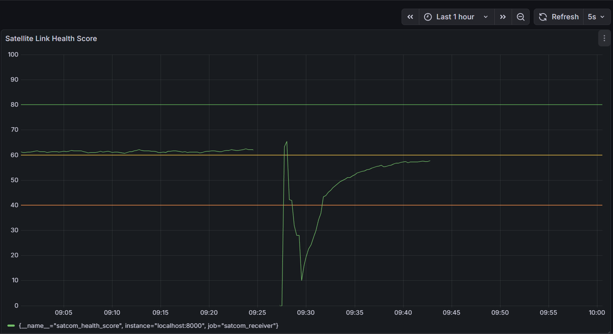
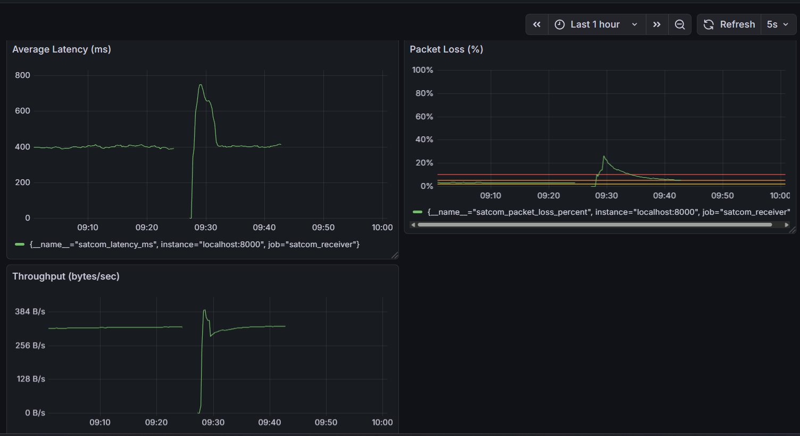

# 🛰️ Satellite Communication Network Monitoring System

## 📌 Overview

A simulated satellite communication network that monitors and visualizes link performance metrics under space-like conditions such as high latency, packet loss, and limited bandwidth.

This project implements a dynamic satellite link emulator with adaptive transmission control and real-time monitoring using Prometheus and Grafana.

---

## 🎯 Objectives

- Simulate satellite communication link behavior
- Measure latency, packet loss, and throughput
- Compute a composite link health score
- Implement adaptive sender control
- Visualize real-time metrics via Grafana

---

## 🏗️ System Architecture

Sender (Ground Station)
↓
Satellite Node (Dynamic Link Model)
↓
Receiver (Metrics + Health Engine)
↓
Prometheus (Time-Series Storage)
↓
Grafana (Dashboard Visualization)


---

## 🔧 Components

### 1️⃣ Sender
- Sends UDP packets with timestamp and sequence number
- Reads health score
- Dynamically adjusts send interval

### 2️⃣ Satellite Node
Simulates link states:
- GOOD
- DEGRADED
- BAD
- OUTAGE

Injects:
- Variable delay
- Packet loss
- TTL decrement

### 3️⃣ Receiver
- Computes end-to-end latency
- Detects packet loss
- Calculates throughput
- Maintains rolling latency window
- Computes composite health score
- Exposes Prometheus metrics

### 4️⃣ Prometheus
- Scrapes metrics every 2 seconds
- Stores time-series data

### 5️⃣ Grafana
- Real-time monitoring dashboard
- Threshold-based visualization
- Dynamic degradation tracking

---

## 📊 Metrics Monitored

- `satcom_latency_ms`
- `satcom_packet_loss_percent`
- `satcom_throughput_bytes_per_sec`
- `satcom_health_score`

---

## 🧠 Health Score Model

Health score is computed as:

Health = 100 − latency penalty − packet loss penalty − throughput penalty


### Threshold Classification

- **80–100** → Healthy
- **60–80** → Degraded
- **40–60** → Poor
- **0–40** → Critical

---

## 🚀 How To Run

### 1️⃣ Start Receiver
```bash
python -m receiver.receiver
```

### 2️⃣ Start Satellite
```bash
python -m satellite.satellite
```
3️⃣ Start Sender
```bash
python -m sender.sender
```
4️⃣ Start Prometheus
```bash
.\prometheus.exe
```

Access:
```bash
http://localhost:9090
```
5️⃣ Open Grafana
```bash
http://localhost:3000
```
📸 Dashboard Preview
### 🔹 Overall Monitoring Dashboard


### 🔹 Degradation Spike



🧪 Observed Behavior

The system demonstrates:

Latency spikes during BAD states

Packet loss increases during degradation

Throughput collapse during outage

Health score recovery after stabilization

Adaptive sender rate adjustment based on link quality

📦 Tech Stack

Python 3.10+

UDP Sockets

Prometheus

Grafana

Git

## 💡 Real-World Relevance

This system mimics real satellite communication challenges such as:

- High latency in GEO satellites
- Packet loss due to atmospheric interference
- Bandwidth constraints in remote regions
- Adaptive rate control in unstable networks

Such monitoring systems are critical in:
- ISRO / NASA ground networks
- Maritime communication systems
- Defense satellite operations
- Remote IoT networks
